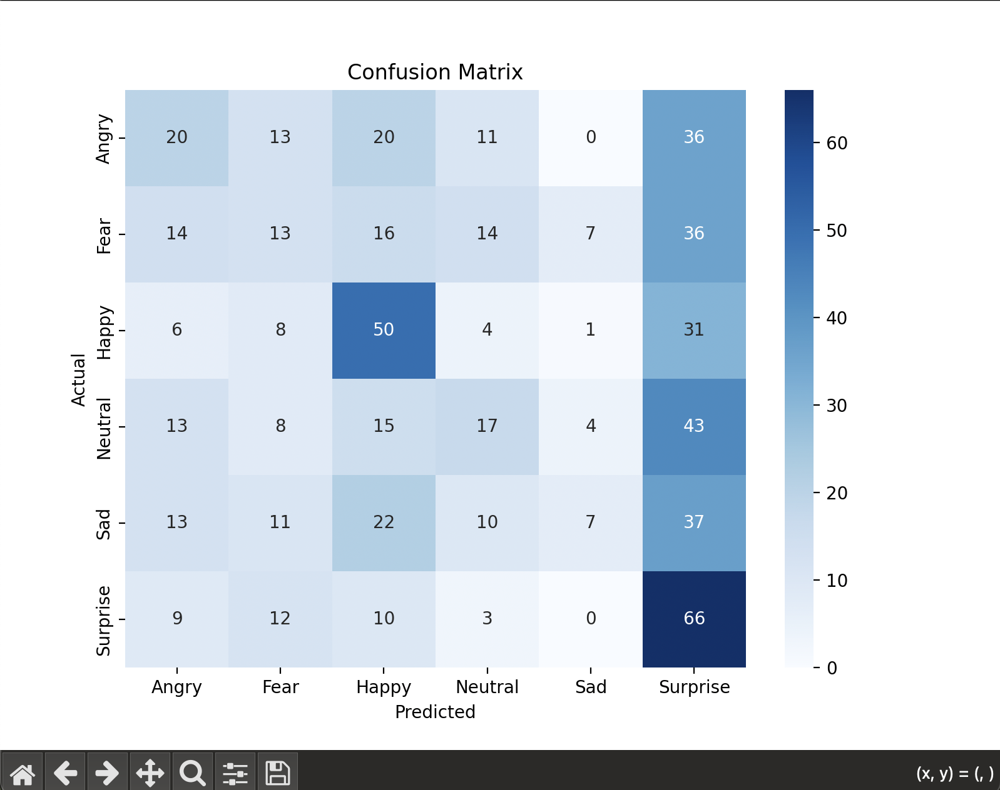
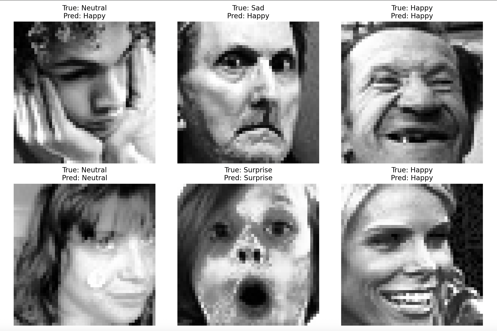

# Facial Expression Recognition System

A CNN-based facial expression recognition system built in Python/Keras, using a genetic algorithm to search for optimal model hyperparameters. Classifies faces into six emotion categories: Angry, Fear, Happy, Neutral, Sad, Surprise.

## Overview

This project trains a convolutional neural network to classify facial expressions from grayscale images. It includes a custom perceptron layer implementing a modified quadratic net input formula, with hand-derived backpropagation rules for that layer, and uses a genetic algorithm to search across CNN hyperparameters (number of convolutional blocks, filter counts, dense units, learning rate) before training the final model on the full dataset.

The objective of this project was implementing each of these components correctly — the custom layer's modified net input and gradient rules, SGD with momentum as the optimiser, and genetic algorithm hyperparameter search — rather than maximising raw classification accuracy. See the Results section below for more on this.

  

## Features

- CNN architecture with configurable convolutional blocks
- Custom Keras layer implementing a modified sigmoid perceptron with a quadratic net input term
- Hand-derived backpropagation weight update rules for the custom layer
- Genetic algorithm hyperparameter search across model configurations
- Data augmentation (rotation, shifts, flips, zoom) to reduce overfitting
- Early stopping and learning rate reduction during training
- Full evaluation pipeline: accuracy, precision, recall, F1, and confusion matrix

## Tech Stack

Python, TensorFlow/Keras, OpenCV, scikit-learn, matplotlib, seaborn

## My Role

Designed and built the full pipeline solo — data loading and preprocessing, CNN architecture, custom layer implementation, genetic algorithm hyperparameter search, and evaluation.

## How to Run

Requirements: Python 3.10+ and pip.

Clone the repo:
git clone https://github.com/NathanKDTownsend/facial-recognition-system.git
cd facial-recognition-system

Install dependencies:
pip install -r requirements.txt

Evaluate the pre-trained model:
python test.py
This loads facial_model.keras and evaluates it against Facial_Recognition_Dataset/Testing, printing accuracy, precision, recall, and F1, and saving a confusion matrix and sample predictions as images.

Retrain from scratch:
python train.py
This runs a genetic-algorithm hyperparameter search over CNN architectures, trains the final model on the full training set, and overwrites facial_model.keras.

## Results

Two factors constrain the accuracy achievable here: SGD was used as the optimiser rather than an adaptive method like Adam, and the dataset (6,000 images across 6 classes) is a fraction of the size used by research-grade emotion recognition models (typically ~35,000 images, achieving 60-70% accuracy). Given these constraints, the close match between validation and test accuracy shows the model is generalising rather than overfitting.

| Metric    | Validation | Test   |
|-----------|-----------|--------|
| Accuracy  | 0.33      | 0.29   |
| Precision | 0.30      | 0.28   |
| Recall    | 0.33      | 0.29   |
| F1 Score  | 0.30      | 0.27   |

The most reliably classified emotions were Happy and Surprise. Fear was most often confused with Surprise and Angry, likely due to overlapping facial features (widened eyes, raised eyebrows) across those expressions.
